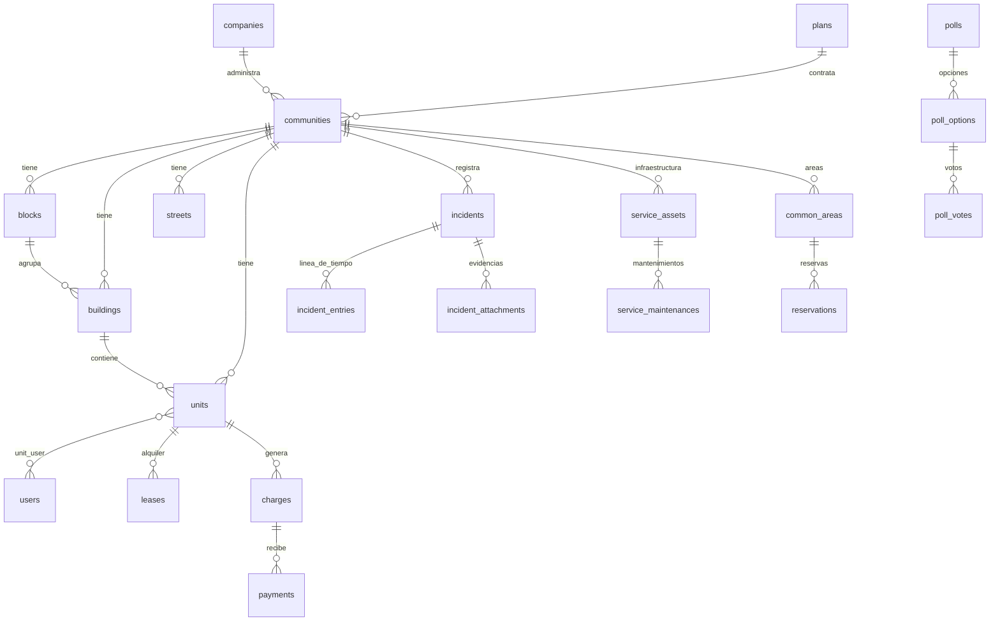

# Base de datos de HabitaControl

Referencia de cada tabla: para qué existe, qué guarda y cómo se relaciona. Las migraciones (`database/migrations`) llevan comentarios con el detalle de cada columna.

Los datos de demostración salen de `php artisan migrate:fresh --seed` (Residencial Los Jardines y dos residenciales más). Todas las cuentas usan la contraseña `password`.

## Mapa de relaciones

## Organización y comercial

| Tabla | Qué hace |
|---|---|
| `companies` | La administradora que opera varios residenciales (nombre, RNC, teléfono). Es el "cliente" que contrata HabitaControl. |
| `plans` | Paquetes comerciales: **Inciden 360** (`incidents`), **HabitaControl Integral** (`integral`) y **Enterprise**. Guarda `price_per_unit` y `implementation_cost`; `Plan::quote($unidades)` calcula la cotización. |
| `communities` | Cada residencial o condominio. Guarda unidades contratadas (`units_count`), niveles, dirección, cuota de mantenimiento, plan (`plan_id`) y `status` (`activo`, `prospecto`, `inactivo`). `meta` es el texto corto que muestra la barra lateral. |

## Estructura territorial

| Tabla | Qué hace |
|---|---|
| `blocks` | Manzanas del residencial. Agrupan edificios y calles. `code` es único dentro de la comunidad. |
| `buildings` | Edificios, con `floors` y `apartments_per_floor`. Pertenecen a una manzana (opcional). |
| `streets` | Calles internas, con referencia de ubicación y `lighting_points` (puntos de luz, útil para reportes de alumbrado). `block_id` nulo = calle general del residencial. |
| `units` | Apartamentos. Además de `community_id`, ubica la unidad en manzana/edificio/piso. Guarda parqueo, cuota, `balance` (deuda vigente), ocupación (`propietario`, `alquilado`, `vacante`), contacto de emergencia y vehículos (JSON). `code` es único **por comunidad**, no global. |
| `unit_user` | Vincula personas con apartamentos y su `relation` (`propietario`, `residente`, `inquilino`). Un usuario puede tener varios apartamentos. |
| `leases` | Contrato de alquiler de una unidad: inquilino, vigencia, renta, depósito y quién lo autorizó. |

> `users.unit_id` se mantiene como la **unidad principal** del usuario (las pantallas actuales de cobros e incidencias la usan). `unit_user` es la fuente completa de vínculos.

## Usuarios y auditoría

| Tabla | Qué hace |
|---|---|
| `users` | Cuentas. Campos propios: `role`, `community_id`, `unit_id`, cédula (`document_id`), teléfono y `active`. Un usuario con `active = false` no puede iniciar sesión y pierde la sesión abierta en su siguiente petición. Roles (`App\Enums\Role`): `superadmin`, `admin`, `propietario`, `residente`, `seguridad`, `mantenimiento`, `junta`. |
| `activity_logs` | Bitácora de auditoría: quién hizo qué y cuándo, con referencia polimórfica al registro afectado (`subject`). Solo se inserta; nunca se edita. |

## Inciden 360 (incidencias)

| Tabla | Qué hace |
|---|---|
| `incidents` | Un caso reportado. `code` (`INC-0001`) se deriva del id. `location_type` indica dónde ocurre (`apartment`, `building`, `block`, `street`, `common_area`) y se acompaña de `unit_id`, `building_id`, `block_id` o `street_id`; `location` es el texto legible. `scope` es la subcategoría. Se asigna a una persona (`assignee_id`) o a un rol (`assignee_role`). `first_response_at` y `closed_at` permiten medir tiempos de respuesta y cierre. `admin_notes` es interno; `resolution` es la solución aplicada; `recurring`/`recurrence_note` marcan casos repetidos. `resident_confirmed_at` y `resident_feedback` guardan la validación final de quien reportó (confirma que se atendió o indica que persiste). |
**Ciclo del caso** (`App\Services\IncidentWorkflow`): *Recibida → En revisión → Asignada → En gestión → Resuelta → Cerrada*. `first_response_at` se fija la primera vez que el caso sale de "Recibida" y `closed_at` al resolverse o cerrarse (se limpia si se reabre). Cada cambio queda en `incident_entries` y en `activity_logs`. Visibilidad: quien reportó ve solo sus casos y no las notas internas ni `admin_notes`; seguridad y mantenimiento, los asignados a ellos o a su rol; administración y junta, los de sus residenciales.

| `incident_entries` | Línea de tiempo del caso: `kind` es `res` (respuesta al residente), `int` (nota interna) o `acc` (acción/cambio de estado). |
| `incident_attachments` | Evidencias. `collection` distingue `evidence` (fotos o videos del problema) de `solution` (evidencia del cierre). Guarda ruta, nombre, tipo MIME y tamaño. |

## Finanzas

El saldo de una unidad y el estado de cada cobro **no se editan a mano**: los calcula `App\Services\Ledger` a partir de cobros (debe) y pagos (haber).

| Tabla | Qué hace |
|---|---|
| `charges` | Cobros a una unidad (cuota, penalidad, extraordinario) con vencimiento. Estados: `Al día` (pagado), `Por vencer`, `Vencido` (hasta 30 días de atraso), `Moroso` (más de 30) y `Legal` (lo marca administración; solo se quita al pagar o retirarlo). El comando diario `charges:refresh-status` los envejece. |
| `payments` | Pagos recibidos. Cada fila cubre **un** cobro (`charge_id`): un solo recibo (`reference`) que cubra varios cobros genera varias filas con la misma referencia. Sin cobro específico, el pago cubre del cobro más antiguo al más reciente. No se permite pagar más que el saldo pendiente. |
| `units.balance` | Suma de lo pendiente de todos los cobros de la unidad; se recalcula en cada cargo o pago. |

Los importes se calculan en centavos enteros para evitar errores de redondeo. Cada movimiento queda en `activity_logs` con la unidad como sujeto.

Visibilidad: administración ve y modifica las finanzas de sus residenciales; la junta las consulta; propietarios y residentes ven las de sus unidades; seguridad y mantenimiento no las ven.

## Servicios generales

| Tabla | Qué hace |
|---|---|
| `service_assets` | Infraestructura compartida: planta eléctrica, pozos, purificación, tanques, bombas. Guarda estado (`operativo`, `mantenimiento`, `alerta`, `revision`, `fuera_servicio`), salud y disponibilidad, capacidad, una lectura (`reading_label` + `reading`, por ejemplo "Combustible 72%"), proveedor, responsable, riesgo y la rutina preventiva (JSON). |
| `service_maintenances` | Historial y programación por activo. `performed_on` nulo = pendiente. `type`: `preventivo` o `correctivo`. La "próxima fecha" de un activo es su mantenimiento pendiente más cercano. |

## Vida en comunidad

| Tabla | Qué hace |
|---|---|
| `visitors` | Garita: nombre, cédula, anfitrión, placa, motivo, `status` (`esperado`, `dentro`, `salio`) y horas de entrada/salida. |
| `common_areas` | Áreas reservables (salón multiuso, cancha) con capacidad y activo/inactivo. |
| `reservations` | Reserva de un área por una unidad: fecha, horas y estado (`pendiente`, `confirmada`, `cancelada`). El índice (área, fecha) sirve para detectar choques de horario. |
| `documents` | Reglamentos, actas, estados financieros. `visibility`: `administracion`, `junta` o `residentes`. |
| `requests` | Solicitudes formales del residente a la administración, con responsable y respuesta. Modelo: `ResidentRequest` (`Request` chocaría con el de HTTP). |
| `notices` / `notice_user` | Avisos de la administración con `audience` (`todos`, `propietarios`, `residentes`, `junta`). `notice_user` registra quién ya los leyó. |
| `messages` | Mensajería interna. `to_user_id` nulo = difusión a toda la comunidad. `read_at` marca lectura. |
| `polls` / `poll_options` / `poll_votes` | Encuestas. El conteo se calcula desde `poll_votes`; el índice único (`poll_id`, `user_id`) garantiza un voto por persona. |

## Tablas del framework

`sessions`/`cache`/`jobs` y las de `migrations` son de Laravel; no contienen datos de negocio.

## Decisiones de diseño

- **Estados como texto**, con el vocabulario en español que ya usaba el proyecto, no como enums de base de datos: agregar un estado no requiere migración.
- **Integridad**: claves foráneas en todas las relaciones; `cascadeOnDelete` cuando el hijo no tiene sentido sin el padre (edificios de una comunidad) y `nullOnDelete` cuando debe conservarse el historial (un incidente sobrevive si se borra al responsable).
- **Multi-residencial**: las tablas de negocio cuelgan de `community_id`, directamente o vía `unit_id`.
- **Migraciones seguras**: las columnas nuevas de tablas existentes son nulables o con valor por defecto. Cada migración tiene `down()` probado (subir → bajar → subir).
